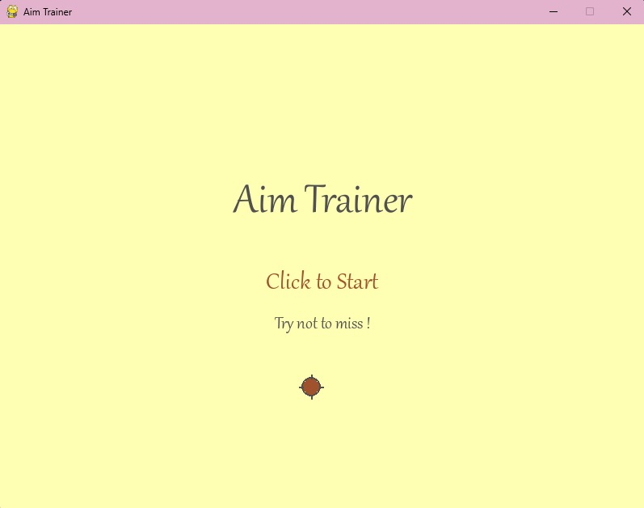
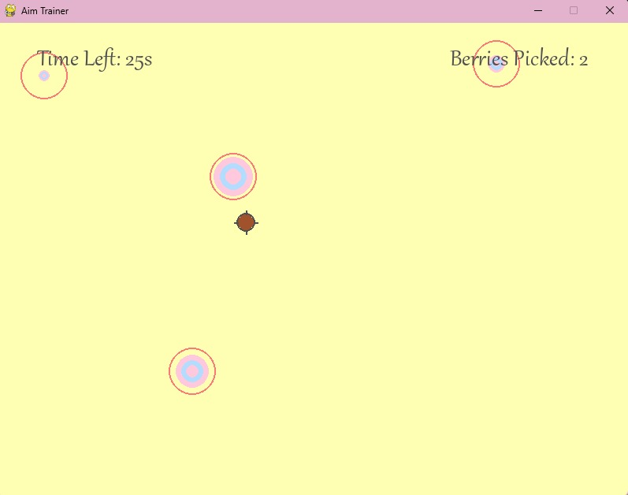
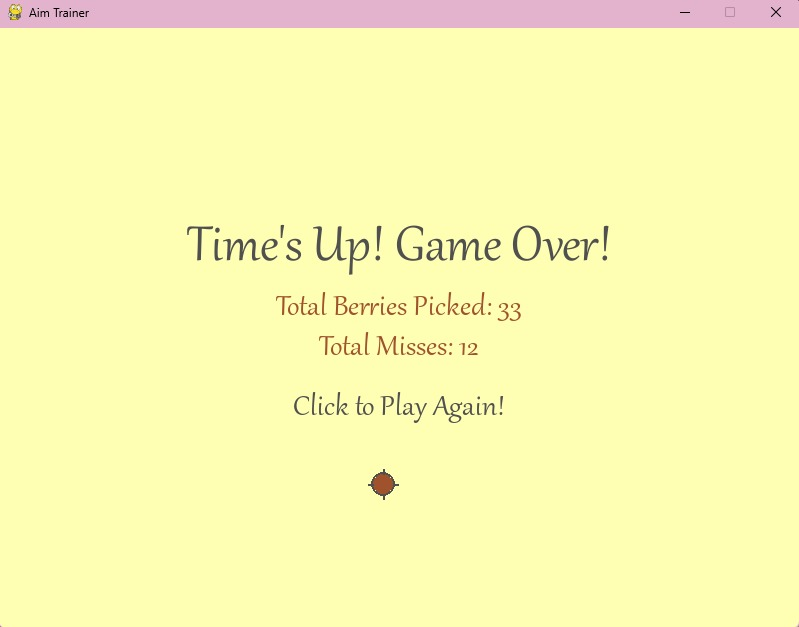

# 🎯 Aim Trainer App  

## Aim Trainer is a simple yet engaging aim training game developed using Pygame. 

The goal is to click on "berries" (targets) as they appear and grow on the screen within a set time limit. 
It's designed to be a fun way to improve your mouse accuracy and reaction time in a visually pleasing, "cozy" environment.

### ✨ Features

* Dynamic Targets: Targets appear, grow, and shrink, requiring quick reflexes to hit them before they disappear.
* Scoring System: Track your "berries picked" (score) and "misses" to evaluate your performance.
* Custom Cursor: A unique cursor to enhance the game's aesthetic.
* Simple Interface: Easy-to-understand start and game-over screens.
* Cute Aesthetics: Pastel color palette and custom fonts create a relaxing and inviting atmosphere.

### 🚀 How to Run

To run this game, you'll need Python and the Pygame library installed on your system.

Prerequisites

* Python 
* Pygame library

### 📦 Installation

To get a local copy up and running, follow these simple steps:

1. Clone the repository:

`git clone https://github.com/ouarda101/aimTrainer.git`

2. Navigate to the project directory:

`cd aimTrainer`

3. Install Pygame:
   
   If you don't have Pygame installed, you can install it using pip:
   
`pip install pygame`

5. Run the game:
   
`python main.py`

### 🛠️ Dependencies

* `pygame` : For game development functionalities.
* `math` : Used for calculating distances (e.g., for collision detection).
* `random` : Used for generating random target positions.
* `time` : Used for managing game timing and target lifespans.

### 🎬 Demos 

1. Start screen

2. Gameplay

3. Game End

📄 **Feel free to explore, fork, and contribute!**
